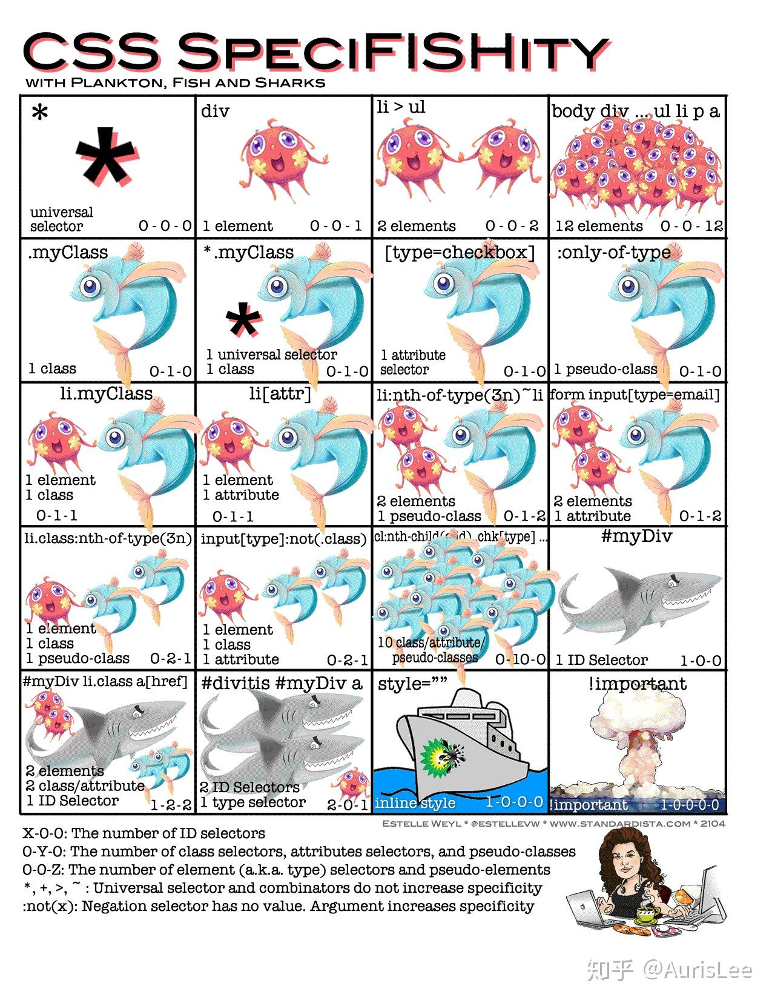

# HTML && CSS

## 一、HTML5 新特性、语义化
### 1.概念：
HTML5的语义化指的是 `合理正确的使用语义化的标签来创建页面结构` 。【正确的标签做正确的
事】
### 2.语义化标签
header nav main article section aside footer
### 3.语义化的优点:
- 在 `没CSS样式的情况下，页面整体也会呈现很好的结构效果`
- `代码结构清晰` ，易于阅读
- `利于开发和维护` 方便其他设备解析（如屏幕阅读器）根据语义渲染⽹⻚。
- `有利于搜索引擎优化（SEO）` ，搜索引擎爬⾍会根据不同的标签来赋予不同的权重

## 二、CSS 选择器及优先级
### 选择器
id选择器(#myid)
- 类选择器(.myclass)
- 属性选择器(a[rel="external"])
- 伪类选择器(a:hover, li:nth-child)
- 标签选择器(div, h1,p)
- 相邻选择器（h1 + p）
- ⼦选择器(ul > li)
- 后代选择器(li a)
- 通配符选择器(*)
### 优先级：
- !important
- 内联样式（1000）
- ID选择器（0100）
- 类选择器/属性选择器/伪类选择器（0010）
- 元素选择器/伪元素选择器（0001）
- 关系选择器/通配符选择器（0000）
带!important 标记的样式属性优先级最⾼； 样式表的来源相同时： !important > 行内样式>ID选
择器 > 类选择器 > 标签 > 通配符 > 继承 > 浏览器默认属性
 

## 三、position 属性的值有哪些及其区别

### 1. static（默认值）
元素按照正常文档流进行排列，不受 top、bottom、left 和 right 属性的影响。
### 2. relative（相对定位）
如果对⼀个元素进行相对定位，它将出现在它所在的位置上。然后可以通过设置垂直或⽔平位置，让这个元素“相对于”它的起点进行移动。 在使用相对定位时，⽆论是否进行移动，元素仍然占据原来的空间。因此，移动元素会导致它覆盖其它框。
### 3. absolute（绝对定位）
绝对定位的元素的位置相对于最近的已定位⽗元素，如果元素没有已定位的⽗元素，那么它的位置相对于。absolute定位使元素的位置与文档流⽆关，因此不占据空间。 absolute定位的元素和其他元素重叠
### 4. fixed（固定定位）
元素的位置相对于浏览器窗⼝是固定位置，即使窗⼝是滚动的它也不会移动。Fixed定位使元素的位置与文档流⽆关，因此不占据空间。 Fixed定位的元素和其他元素重叠
### 5. sticky（粘性定位）
元素先按照普通文档流定位，然后相对于该元素在流中的 flow root（BFC）和 containing block（最近的块级祖先元素）定位。而后，元素定位表现为在跨越特定阈值前为相对定位，之后为固定定位。

## 四、box-sizing属性
```
CSS的盒子模型有哪些：标准盒子模型、IE盒子模型
CSS的盒子模型区别：
  标准盒子模型：margin、border、padding、content
  IE盒子模型 ：margin、content（ border +  padding  + content ）
通过CSS如何转换盒子模型：
  box-sizing: content-box;  /*标准盒子模型*/
  box-sizing: border-box; /*IE盒子模型*/
```
## 五、BFC（块级格式上下文）
BFC就是页面上一个隔离的独立容器，容器里面的子元素不会影响到外面的元素。

```
1. 了解BFC ： 块级格式化上下文。
2. BFC的原则：如果一个元素具有BFC，那么内部元素再怎么弄，都不会影响到外面的元素。
3. 如何触发BFC：
  - float的值非none
  - overflow的值非visible
  - display的值为：为inline-block、table-cell、table-caption...
  - position的值为:absoute、fixed
4. BFC的使用场景
  - 去除边距重叠现象
  - 清除浮动（让⽗元素的⾼度包含⼦浮动元素）
  - 避免某元素被浮动元素覆盖
  - 避免多列布局由于宽度计算四舍五⼊而⾃动换行
```
#### 清除浮动有哪些方式？
```
1. 触发BFC
2. 多创建一个盒子，添加样式：clear: both;
3. after方式
  ul:after{
    content: '';
    display: block;
    clear: both;
  }
```
## 六、让一个元素水平垂直居中的方式有哪些？
```
<div class='container'>
  <div class='main'>main</div> 
</div>
```
### 1.定位+margin
`须知元素main的宽高`
```
.container{
  position: relative;
  width: 300px;
  height: 300px;
  border:5px solid #ccc;
}
.main{
  position:absolute;
  left:50%;
  top:50%;
  width:120px;
  height:180px;
  margin-left: -60px;
  margin-top:-90px;
  background: red;
}

```
####  margin:auto
```
.container{
  position: relative;
  width: 300px;
  height: 300px;
  border:5px solid #ccc;
}
.main{
  position: absolute;
  width:120px;
  height:180px;
  left:0;
  top:0;
  right: 0;
  bottom: 0;
  margin:auto;
  background: red;
}
```
### 2.定位+transform
```
.container{
  position: relative;
  width: 300px;
  height: 300px;
  border:5px solid #ccc;
}
.main{
  position: absolute;
  left:50%;
  top:50%;
  background: red;
  transform: translate(-50%,-50%);
}
```
### 3.flex布局
```
.container{
  display: flex;
  justify-content: center;
  align-items: center;
  width: 300px;
  height: 300px;
  border:5px solid #ccc;
}
.main{
  background: red;
}
```
### 4.grid布局
```
.container {
  width: 300px;
  height: 300px;
  display: grid;
  align-items: center;
  justify-items: center;
  border:5px solid #ccc;
}
.main{
  background: red;
}
```
### 5.table布局
```
.container {
  display: table;
  width: 300px;
  height: 300px;
  border: 1px solid #ccc;
}
.main{
  display: table-cell;
  vertical-align: middle;
  text-align: center;
  background: red;
}
```
## 七、隐藏元素的方法有哪些？
- `display:none;`
  把元素隐藏起来，并且会改变页面布局，可以理解成在页面中把该元素。 不显
示对应的元素，在文档布局中不再分配空间（回流+重绘）
- `opacity:0;`
  该元素隐藏起来了，但不会改变页面布局，并且，如果该元素已经绑定 ⼀些事件，
如click 事件，那么点击该区域，也能触发点击事件的
- `visibility:hidden;`
  该元素隐藏起来了，但不会改变页面布局，但是不会触发该元素已 经绑
定的事件 ，隐藏对应元素，在文档布局中仍保留原来的空间（重绘）
- `position:absolute;`
- `clip-path;` // 使用裁剪方式创建元素的可显示区域。区域内的部分显示，区域外的隐藏。可以指定一些特定形状。

```
重排（回流）：布局引擎会根据所有的样式计算出盒模型在页面上的位置和大小
重绘：计算好盒模型的位置、大小和其他一些属性之后，浏览器就会根据每个盒模型的特性进行绘制浏览器的渲染机制

对DOM的大小、位置进行修改后，浏览器需要重新计算元素的这些几何属性，就叫重排
对DOM的样式进行修改，比如color和background-color，浏览器不需要重新计算几何属性的时候，直接绘制了该元素的新样式，那么这里就只触发了重绘
```
## 八、用CSS实现三角形
`记忆⼝诀：盒⼦宽⾼均为零，三⾯边框皆透明。`
```
div {
  width: 0;
  height: 0;
  border-top: 20px solid transparent;
  border-right: 20px solid transparent;
  border-bottom: 20px solid red;
  border-left: 20px solid transparent;
}
```
## 九、页面布局
### 1. Flex 布局
布局的传统解决方案，基于盒状模型，依赖 display 属性 + position 属性 + float 属性。它对于那些特
殊布局⾮常不方便，⽐如，垂直居中就不容易实现。

Flex 是 Flexible Box 的缩写，意为"弹性布局",用来为盒状模型提供最⼤的灵活性。指定容器 display:
flex 即可。 简单的分为容器属性和元素属性。

1. 容器的属性：
  ```
  flex-direction：决定主轴的方向（即⼦ item 的排列方法）flex-direction: row | row-reverse |
column | column-reverse;
  flex-wrap：决定换行规则 flex-wrap: nowrap | wrap | wrap-reverse;
  flex-flow： .box { flex-flow: || ; }
  justify-content：对其方式，⽔平主轴对⻬方式
  align-items：对⻬方式，竖直轴线方向
  align-content
  ```
2. 项⽬的属性（元素的属性）：
  ```
  order 属性：定义项⽬的排列顺序，顺序越⼩，排列越靠前，默认为 0
  flex-grow 属性：定义项⽬的放⼤⽐例，即使存在空间，也不会放⼤
  flex-shrink 属性：定义了项⽬的缩⼩⽐例，当空间不⾜的情况下会等⽐例的缩⼩，如果 定义个
  item 的 flow-shrink 为 0，则为不缩⼩
  flex-basis 属性：定义了在分配多余的空间，项⽬占据的空间。
  flex：是 flex-grow 和 flex-shrink、flex-basis 的简写，默认值为 0 1 auto。
  align-self：允许单个项⽬与其他项⽬不⼀样的对⻬方式，可以覆盖
  align-items，默认属 性为 auto，表示继承⽗元素的 align-items ⽐如说，用 flex 实现圣杯布局
  ```
  ### 2.圣杯布局
  ```
   <div class="content">
    <div class="middle">middle</div>
    <div class="left">left</div>
    <div class="right">right</div>
  </div>
  ```

  ```
  .middle {
    width: 100%;
    background: #ccc;
    float: left;
  }
  .left {
    position: relative;
    width: 100px;
    background: #c3e;
    float: left;
    margin-left: -100%;
    right:100px;
    /* left:-100px; */
  }
  .right {
    width: 100px;
    background: #e7e;
    float: left;
    margin-right: -100px;
  }

  .content {
    height: 200px;
    padding-left: 100px;
    padding-right: 100px;
    overflow: hidden;
    background:red;
  }
  ```
  `flex 布局`
  ```
  .middle {
    width: 100%;
    background: #ccc;
  }
  .left {
    width: 100px;
    background: #c3e;
    order: -1;
  }
  .right {
    width: 100px;
    background: #e7e;
  }

  .content {
    height: 200px;
    padding-left: 100px;
    padding-right: 100px;
    overflow: hidden;
    background:red;
    display:flex;
  }
  ```
  ### 3.双飞翼布局
  ```
  <div class="warp">
     <div class="content">
       <div class="main">content</div>
     </div>
     <div class="left">left</div>
     <div class="right">right</div>
  </div>
  ```

  ```
  .warp{
    width: 100%
    height: 300x;
    background: #666;
    margin: 0 auto;
  }
  .content{
    float: left;
    width: 100%;
    height: 100%;
  }
  .main{
    background: darkgoldenrod;
    margin: 0 200px;
    height: 300px;
  }
  .left{
    position: relative;
    float: left;
    width: 200px;
    height: 300px;
    background: salmon;
    margin-left: -100%;
  }
  .right{
    float: left;
    width: 200px;
    height: 300px;
    background:#ccc;
    margin-left: -200px;
  }
  ```

  ### 4.rem布局
  ⾸先 rem 相对于根(html)的 font-size ⼤⼩来计算。<br>
  简单的说它就是⼀个相对单例 如:font-size:10px;,那么（1rem = 10px）<br>
  了解计算原理后⾸先解决怎么在不同设备上设置 html 的 font-size ⼤⼩。
  <br>其实rem 布局的本质是等⽐缩放，⼀般是基于宽度。
  - 优点：可以快速适用移动端布局，字体，图⽚⾼度
  - 缺点：
    1. ⽬前 ie 不⽀持，对 pc 页面来讲使用次数不多；
    2. 数据量⼤：所有的图⽚，盒⼦都需要我们去给⼀个准确的值；才能保证不同机型的适配；
    3. 在响应式布局中，必须通过 js 来动态控制根元素 font-size 的⼤⼩。也就是说 css 样式和 js 代码有
    ⼀定的耦合性。且必须将改变 font-size 的代码放在 css 样式之前。


# javascript
## 十.JavaScript数据类型 7种
基本数据类型：`String`、`Number`、`Boolean`、`Undefined`、`Null`。
当ES6问世，直至今日，又新增了两种基本数据类型：`Symbol`（ES新增）、`BigInt`（ES10新增）

引用类型：`object`,包括 Object Array、Function、Date、RegExp 等。

## 十一.JS判断变量是不是数组
##### 方式一：isArray

```
var arr = [1,2,3];
console.log( Array.isArray( arr ) );
```

##### 方式二：instanceof  【可写,可不写】

```
var arr = [1,2,3];
console.log( arr instanceof Array );
```

##### 方式三：原型prototype

```
var arr = [1,2,3];
console.log( Object.prototype.toString.call(arr).indexOf('Array') > -1 );
```

#### 方式四：isPrototypeOf()

```
var arr = [1,2,3];
console.log(  Array.prototype.isPrototypeOf(arr) )
```

#### 方式五：constructor

```
var arr = [1,2,3];
console.log( arr.constructor.toString().indexOf('Array') > -1 )
```

## 十二.var && let && const
ES6之前创建变量用的是var,之后创建变量用的是let/const
`三者区别：`
  1. var定义的变量， 没有块的概念，可以跨块访问 , 不能跨函数访问。<br>
  let定义的变量，只能在块作用域⾥访问，不能跨块访问，也不能跨函数访问。<br>
  const用来定义常量，使用时必须初始化(即必须赋值)，只能在块作用域⾥访问，且不能修改。
  2. var可以 先使用，后声明 ，因为存在变量提升；<br>let必须先声明后使用。
  3. var是允许在相同作用域内 重复声明同⼀个变量 的，<br>而let与const不允许这⼀现象。
  4. 浏览器环境顶层对象是: `window`，node环境顶层对象是: `global`，var声明的全局变量会挂在顶层对象下面，<br>而let、const不会挂在顶层对象下面
  5. 会产⽣暂时性死区 ：<br>
  暂时性死区是浏览器的bug：检测⼀个未被声明的变量类型时，不会报错，会返回undefined<br>
  如：console.log(typeof a) //undefined<br>
  而：console.log(typeof a)//未声明之前不能使用<br>
  let a
  6. let /const/function会把当前所在的⼤括号(除函数之外)作为⼀个全新的块级上下文，应用这个机
  制，在开发项⽬的时候，遇到循环事件绑定等类似的需求，⽆需再⾃⼰构建闭包来存储，只要基于
  let的块作用特征即可解决

  ## 十三.JS垃圾回收机制
  - 缺点：闭包较多的时候，会消耗内存，导致页面的性能下降，在IE浏览器中才会导致内存泄漏
  - 使用场景：防抖，节流，函数嵌套函数避免全局污染的时候
  1. 项⽬中，如果存在⼤量不被释放的内存（堆/栈/上下文），页面性能会变得很慢。当某些代码操作
  不能被合理释放，就会造成IE内存泄漏。我们尽可能减少使用闭包，因为它会消耗内存。
  2. 浏览器垃圾回收机制/内存回收机制:
    - 浏览器的 Javascript 具有⾃动垃圾回收机制( GC:Garbage Collecation )，垃圾收集器
  会定期（周期性）找出那些不在继续使用的变量，然后释放其内存。
  3. `标记清除`:在 js 中，最常用的垃圾回收机制是`标记清除`：当变量进⼊执行环境时，被标记为“进⼊
  环境”，当变量离开执行环境时，会被标记为“离开环境”。垃圾回收器会销毁那些带标记的值并
  回收它们所占用的内存空间。<br>
  - ⾕歌浏览器：“`查找引用`”，浏览器不定时去查找当前内存的引用，如果没有被占用了，浏览器会
  回收它；如果被占用，就不能回收。<br>
  - IE浏览器：“`引用计数法`”，当前内存被占用⼀次，计数累加1次，移除占用就减1，减到0时，浏
  览器就回收它。
  4. 优化⼿段：内存优化 ; ⼿动释放：取消内存的占用即可。
  5. （1）堆内存：fn = null 【null：空指针对象】
  6. （2）栈内存：把上下文中，被外部占用的堆的占用取消即可。
  7. 内存泄漏
  8. 在 JS 中，常⻅的内存泄露主要有 4 种,全局变量、闭包、DOM 元素的引用、定时器<br>
  [一篇看懂JS垃圾回收机制](https://mp.weixin.qq.com/s?src=11&timestamp=1730878177&ver=5611&signature=nCD1BzNfKW2mpTepYgplurb0R6Hg0pzJtvHxnmim2elTYrDxs4AKxo3spXY6tSM1fLsGg2r6tdBVyR*d*Fkq-AVnNbougoNZirklJ-k4V2Ayod2CvGMYvcwpJNP*lpZc&new=1)
  ## 十四.什么是闭包，闭包有什么特点？
  - 什么是闭包？函数嵌套函数，内部函数被外部函数返回并保存下来时，就会产生闭包
  - 特点：可以重复利用变量，并且这个变量不会污染全局的一种机制；这个变量是一直保存再内存中，不会被垃圾回收机制回收
  - 闭包缺点：会导致函数的变量⼀直保存在内存中，过多的闭包可能会导致内存泄漏

  - 闭包形成的条件：<br>
      a. 函数的嵌套<br>
      b. 内部函数引用外部函数的局部变量，延⻓外部函数的变量⽣命周期
  - 闭包的用途：<br>
      a. 模仿块级作用域<br>
      b. 保护外部函数的变量 能够访问函数定义时所在的词法作用域(阻⽌其被回收)<br>
      c. 封装私有化变量<br>
      d. 创建模块
- 闭包的两个场景<br>
 在开发中, 其实我们随处可⻅闭包的⾝影, ⼤部 分前端JavaScript 代码都是“事件驱动”的,即⼀个事件绑定的回调方法;
  1. 发送ajax请求成功|失败的回调;
  2. setTimeout的延时回调;
  3. ⼀个函数内部返回另⼀个匿名函数,这些都是闭包的应用。

  ## 十五.JS 中 this 的五种情况
  1. 作为普通函数执行时， this 指向 window 。
  2. 当函数作为对象的方法被调用时， this 就会指向 该对象 。
  3. 构造器调用， this 指向 返回的这个对象 。
  4. 箭头函数 箭头函数的 this 绑定看的是 this所在函数定义在哪个对象下 ，就绑定哪个对象。如
  果有嵌套的情况，则this绑定到最近的⼀层对象上。
  5. 基于Function.prototype上的 apply 、 call 和 bind 调用模式，这三个方法都可以显示的
  指定调用函数的 this 指向。
  - apply 接收参数的是数组，
  - call 接受参数列表，``
  - bind 方法通过传⼊⼀个对象，返回⼀个 this 绑定了传⼊对象的新函数。这个函数的 this 指向除了使用 new 时会被改变，其他情况下都不会改变。若为空默认是指向全局对象window。
```
  <!-- 1. 用apply的情况 -->
  var arr1 = [1,2,4,5,7,3,321];
  console.log( Math.max.apply(null,arr1) )

  <!-- 2. 用bind的情况 -->
  var btn = document.getElementById('btn');
  var h1s = document.getElementById('h1s');
  btn.onclick = function(){
    console.log( this.id );
  }.bind(h1s)
```

## 十六.new操作符具体做了什么
<details open>
  <summary>new操作符具体做了什么</summary>

```javascript
function create( fn , ...args ){
    //1. 创建了一个空的对象
    var obj = {}; //var obj = Object.create({})
    //2. 将空对象的原型，指向于构造函数的原型
    Object.setPrototypeOf(obj,fn.prototype);
    //3. 将空对象作为构造函数的上下文（改变this指向）
    var result = fn.apply(obj,args);
    //4. 对构造函数有返回值的处理判断
    return result instanceof Object ? result : obj;
  }
```
</details>

## 十七.请描述event-loop的机制, 什么是宏任务和微任务，两者有什么区别？

```
  在Job queue中的队列分为两种类型：macro-task和microTask。我们举例来看执行顺序的规定，我们设

  macro-task队列包含任务: a1, a2 , a3
  micro-task队列包含任务: b1, b2 , b3

  执行顺序为，首先执行marco-task队列开头的任务，也就是 a1 任务，执行完毕后，在执行micro-task队列里的所有任务，也就是依次执行b1, b2 , b3，执行完后清空micro-task中的任务，接着执行marco-task中的第二个任务，依次循环。

  了解完了macro-task和micro-task两种队列的执行顺序之后，我们接着来看，真实场景下这两种类型的队列里真正包含的任务（我们以node V8引擎为例），在node V8中，这两种类型的真实任务顺序如下所示：

  macro-task队列真实包含任务：

  script(主程序代码),setTimeout, setInterval, setImmediate, I/O, UI rendering

  micro-task队列真实包含任务：
  process.nextTick, Promises, Object.observe, MutationObserver

  由此我们得到的执行顺序应该为：

  script(主程序代码)—>process.nextTick—>Promises...——>setTimeout——>setInterval——>setImmediate——> I/O——>UI rendering

  在ES6中macro-task队列又称为ScriptJobs，而micro-task又称PromiseJobs

  ## 什么宏任务和微任务，两者有什么区别？

  宏任务：setTimeout、setInterval、Ajax、DOM时间
  微任务：Promise async/await
  微任务是ES6语法规定的
  宏任务是浏览器规定的
  微任务执行时机比宏任务早（微任务在DOM渲染前执行，宏任务在DOM渲染后执行）

  setTimeout(function(){console.log(1)},0);

  new Promise(function(resolve,reject){
    console.log(2);
    resolve();
  }).then(function(){console.log(3)
  }).then(function(){console.log(4)});

  process.nextTick(function(){console.log(5)});

  console.log(6);
  //输出2,6,5,3,4,1

  setTimeout(function(){console.log(1)},0);

  new Promise(function(resolve,reject){
    console.log(2);
    setTimeout(function(){resolve()},0)
  }).then(function(){console.log(3)
  }).then(function(){console.log(4)});

  process.nextTick(function(){console.log(5)});

  console.log(6);

  //输出的是  2 6 5 1 3 4
```
参考文章：
[从promise、process.nextTick、setTimeout出发，谈谈Event Loop中的Job queue](https://github.com/forthealllight/blog/issues/5)


## 十八.有听过函数防抖和函数节流吗？

<details open>
  <summary>函数防抖（debounce）</summary>

```javascript
// 防抖的中心思想在于：我会等你到底。在某段时间内，不管你触发了多少次回调，我都只认最后一次。
    function debounce(fn,duration) {
        let timer = null
        return function(...args) {
          const context = this
          if (timer) {
            clearTimeout(timer)
          }
          timer = setTimeout(function() {
            fn.apply(context, args)
          }, duration)
        }
      }
```
</details>

<details open>
   <summary>函数节流（throttle）</summary>

```javascript
      // throttle 的中心思想在于：在某段时间内，不管你触发了多少次回调，我都只认第一次，并在计时结束时给予响应。
      function throttle (fn, duration) {
        // last为上一次触发回调的时间
        let last = 0

        return function(...args) {
          const context = this
          const now = Date.now()
          // 判断上次触发的时间和本次触发的时间差是否小于时间间隔的阈值
          if (now - last >= duration) {
            last = now
            fn.apply(context, args)
          }
        }
      }
```
</details>

## 十九.简述MVVM
### 什么是MVVM？
  视图模型双向绑定 ，是 `Model-View-ViewModel` 的缩写，也就是把 MVC 中的 `Controller` 演
  变成 `ViewModel`。`Model` 层代表数据模型， `View` 代表UI组件， `ViewModel` 是 `View` 和
  `Model` 层的桥梁，数据会绑定到 `viewModel` 层并⾃动将数据渲染到页面中，视图变化的时候会通
  知 `viewModel` 层更新数据。<br>
  以前是操作DOM结构更新视图，现在是 `数据驱动视图` 。
### MVVM的优点：
  1. `低耦合` 。视图（View）可以独⽴于Model变化和修改，⼀个Model可以绑定到不同的View上，当
  View变化的时候Model可以不变化，当Model变化的时候View也可以不变；
  2. `可重用性` 。你可以把⼀些视图逻辑放在⼀个Model⾥⾯，让很多View重用这段视图逻辑。
  3. `独⽴开发` 。开发⼈员可以专注于业务逻辑和数据的开发(ViewModel)，设计⼈员可以专注于页面设
  计。
  4. `可测试` 。

## 二十.Vue底层实现原理
vue.js是采用`数据劫持`结合`发布者-订阅者模式`的方式，通过Object.defineProperty()来劫持各个属性
的setter和getter，在数据变动时发布消息给订阅者，触发相应的监听回调<br>
Vue是⼀个典型的MVVM框架，模型（Model）只是普通的javascript对象，修改它则试图（View）会
⾃动更新。这种设计让状态管理变得⾮常简单而直观<br>
- `Observer`（数据监听器） : Observer的核⼼是通过Object.defineProprtty()来监听数据的变动，这个
函数内部可以定义setter和getter，每当数据发⽣变化，就会触发setter。这时候Observer就要通知订
阅者，订阅者就是Watcher<br>
- `Watcher`（订阅者） : Watcher订阅者作为Observer和Compile之间通信的桥梁，主要做的事情是：
  1. 在⾃⾝实例化时往属性订阅器(dep)⾥⾯添加⾃⼰
  2. ⾃⾝必须有⼀个update()方法
  3. 待属性变动dep.notice()通知时，能调用⾃⾝的update()方法，并触发Compile中绑定的回调<br>
- `Compile`（指令解析器） : Compile主要做的事情是解析模板指令，将模板中变量替换成数据，然后初
始化渲染页面视图，并将每个指令对应的节点绑定更新函数，添加鉴定数据的订阅者，⼀旦数据有变动，收到通知，更新试图

## 二十一.谈谈对vue⽣命周期的理解？
vue实例有⼀个完整的⽣命周期，也就是从开始创建、初始化数据、编译模版、挂载Dom、渲染、更新、卸载等⼀系列过程，称这是vue的⽣命周期。<br>
1. `beforeCreate`（创建前） ：在数据观测和初始化事件还未开始（此时data和methods中的数据都还没有初始化）
2. `created`（创建后） ：实例创建完成后，此时已经完成了数据观测，属性和方法的运算，`watch/event`事件回调。然而，挂载阶段还没开始，`$el`属性目前不可见
3. `beforeMount`（挂载前） ：在挂载开始之前被调用：相关的render函数首次被调用。该钩在服务器端渲染期间不被调用。
4. `mounted`（挂载后） ：`el`被新创建的`vm.$el`替换，并挂载到实例上去之后调用该钩子。如果根实例挂载到了一个文档内元素上，当`mounted`被调用时vm.$el也在文档内。
5. `beforeUpdate`（更新前） ：数据更新时调用，发生在虚拟DOM重新渲染和打补丁之前。你可以在这个钩⼦中进一步地更改状态，这不会触发附加的重渲染过程。
6. `updated`（更新后） ：由于数据更改导致的虚拟DOM重新渲染和打补丁，在这之后会调用该钩⼦。当这个钩⼦被调用时，组件DOM已经更新，所以你现在可以执行依赖于DOM的操作。然而在大多数情况下，你应该避免在此期间更改状态，因为这可能会导致更新无限循环。该钩在服务器端渲染期间不被调用。
7. `beforeDestroy`（销毁前） ：实例销毁之前调用。在这一步，实例仍然完全能用。
8. `destroyed`（销毁后） ：Vue 实例销毁后调用。调用后，Vue 实例指示的所有东西都会解绑定，所有的事件监听器会被移除，所有的子实例也会被销毁。

## 二十二.computed、methods、watch区别
1. `computed` 是计算属性，依赖其它属性计算值，并且 `computed` 的值有`缓存`，只有它`依赖`的属性值发⽣改变时才会重新计算，如果一进入页面调用，就会触发
2. `methods` 是方法，⽆缓存，每调用一次就执行一次
3. `watch` 监听属性值的变化，当数据发生改变时，才会触发，可以得到现在的值和过去的值

## 二十三.组件中的data为什么是⼀个函数？
`data` 是⼀个函数，这样每复用⼀次组件，就会返回⼀个全新的对象，而不会造成数据之间的污染。
如果 data 是⼀个对象，那么由于对象属于引用类型，当复用组件时，它们的内存指向是同⼀个地
址，当⼀个组件中的 data 发⽣变化时，就会影响到其它的组件

## 二十四.为什么v-for和v-if不建议用在⼀起
  1. 当 v-for 和 v-if 处于同⼀个节点时，v-for 的优先级⽐ v-if 更⾼，这意味着 v-if 将分别重复运行于每个
  v-for 循环中。如果要遍历的数组很⼤，而真正要展示的数据很少时，这将造成很⼤的性能浪费
  （Vue2.x）
  2. 这种场景建议使用 computed，先对数据进行过滤<br>
  3. 3.x 版本中 v-if 总是优先于 v-for ⽣效
## 二十五.nextTick的实现
1. `nextTick` 是 `Vue` 提供的⼀个全局 `API` ,是在下次 `DOM` 更新循环结束之后执行延迟回调，在修
改数据之后使用 `$nextTick` ，则可以在回调中获取更新后的 `DOM` ；
2. Vue在更新DOM时是异步执行的。只要侦听到数据变化， `Vue` 将开启1个队列，并缓冲在同⼀事件
循环中发⽣的所有数据变更。如果同⼀个 `watcher` 被多次触发，只会被推⼊到队列中-次。这种
在缓冲时去除重复数据对于避免不必要的计算和 DOM 操作是⾮常重要的。 `nextTick` 方法会在
队列中加⼊⼀个回调函数，确保该函数在前⾯的dom操作完成后才调用；
3. ⽐如，我在⼲什么的时候就会使用nextTick，传⼀个回调函数进去，在⾥⾯执行dom操作即可；
4. 我也有简单了解 `nextTick` 实现，它会在 `callbacks` ⾥⾯加⼊我们传⼊的函数，然后用
`timerFunc` 异步方式调用它们，⾸选的异步方式会是 `Promise` 。这让我明⽩了为什么可以在
`nextTick` 中看到 dom 操作结果。

## 二十六.Vue组件的通信（组件的传值）
**`Vue3`组件通信和`Vue2`的区别：**

* 移出事件总线，使用`mitt`代替。

- `vuex`换成了`pinia`。
- 把`.sync`优化到了`v-model`里面了。
- 把`$listeners`所有的东西，合并到`$attrs`中了。
- `$children`被砍掉了。

**常见搭配形式：**

 

### 6.1. 【props】

概述：`props`是使用频率最高的一种通信方式，常用与 ：**父 ↔ 子**。

- 若 **父传子**：属性值是**非函数**。
- 若 **子传父**：属性值是**函数**。

父组件：

```vue
<template>
  <div class="father">
    <h3>父组件，</h3>
		<h4>我的车：{{ car }}</h4>
		<h4>儿子给的玩具：{{ toy }}</h4>
		<Child :car="car" :getToy="getToy"/>
  </div>
</template>

<script setup lang="ts" name="Father">
	import Child from './Child.vue'
	import { ref } from "vue";
	// 数据
	const car = ref('奔驰')
	const toy = ref()
	// 方法
	function getToy(value:string){
		toy.value = value
	}
</script>
```

子组件

```vue
<template>
  <div class="child">
    <h3>子组件</h3>
		<h4>我的玩具：{{ toy }}</h4>
		<h4>父给我的车：{{ car }}</h4>
		<button @click="getToy(toy)">玩具给父亲</button>
  </div>
</template>

<script setup lang="ts" name="Child">
	import { ref } from "vue";
	const toy = ref('奥特曼')
	
	defineProps(['car','getToy'])
</script>
```

### 6.2. 【自定义事件】

1. 概述：自定义事件常用于：**子 => 父。**
2. 注意区分好：原生事件、自定义事件。

- 原生事件：
  - 事件名是特定的（`click`、`mosueenter`等等）	
  - 事件对象`$event`: 是包含事件相关信息的对象（`pageX`、`pageY`、`target`、`keyCode`）
- 自定义事件：
  - 事件名是任意名称
  - <strong style="color:red">事件对象`$event`: 是调用`emit`时所提供的数据，可以是任意类型！！！</strong >

3. 示例：

   ```html
   <!--在父组件中，给子组件绑定自定义事件：-->
   <Child @send-toy="toy = $event"/>
   <!--注意区分原生事件与自定义事件中的$event-->
   <button @click="toy = $event">测试</button>
   ```
   ```js
   //子组件中，触发事件：
   this.$emit('send-toy', 具体数据)
   ```

### 6.3. 【mitt】

概述：与消息订阅与发布（`pubsub`）功能类似，可以实现任意组件间通信。

安装`mitt`

```shell
npm i mitt
```
新建文件：`src\utils\emitter.ts`

```javascript
// 引入mitt 
import mitt from "mitt";
// 创建emitter
const emitter = mitt()
/*
  // 绑定事件
  emitter.on('abc',(value)=>{
    console.log('abc事件被触发',value)
  })
  emitter.on('xyz',(value)=>{
    console.log('xyz事件被触发',value)
  })

  setInterval(() => {
    // 触发事件
    emitter.emit('abc',666)
    emitter.emit('xyz',777)
  }, 1000);

  setTimeout(() => {
    // 清理事件
    emitter.all.clear()
  }, 3000);
*/
// 创建并暴露mitt
export default emitter
```
接收数据的组件中：绑定事件、同时在销毁前解绑事件：

```typescript
import emitter from "@/utils/emitter";
import { onUnmounted } from "vue";

// 绑定事件
emitter.on('send-toy',(value)=>{
  console.log('send-toy事件被触发',value)
})

onUnmounted(()=>{
  // 解绑事件
  emitter.off('send-toy')
})
```

【第三步】：提供数据的组件，在合适的时候触发事件

```javascript
import emitter from "@/utils/emitter";

function sendToy(){
  // 触发事件
  emitter.emit('send-toy',toy.value)
}
```

**注意这个重要的内置关系，总线依赖着这个内置关系**

### 6.4.【v-model】

1. 概述：实现 **父↔子** 之间相互通信。

2. 前序知识 —— `v-model`的本质

   ```vue
   <!-- 使用v-model指令 -->
   <input type="text" v-model="userName">
   <!-- v-model的本质是下面这行代码 -->
   <input 
     type="text" 
     :value="userName" 
     @input="userName =(<HTMLInputElement>$event.target).value"
   >
   ```
3. 组件标签上的`v-model`的本质：`:moldeValue` ＋ `update:modelValue`事件。

   ```vue
   <!-- 组件标签上使用v-model指令 -->
   <AtguiguInput v-model="userName"/>
   <!-- 组件标签上v-model的本质 -->
   <AtguiguInput :modelValue="userName" @update:model-value="userName = $event"/>
   ```

   `AtguiguInput`组件中：

   ```vue
   <template>
     <div class="box">
       <!--将接收的value值赋给input元素的value属性，目的是：为了呈现数据 -->
   		<!--给input元素绑定原生input事件，触发input事件时，进而触发update:model-value事件-->
       <input 
          type="text" 
          :value="modelValue" 
          @input="emit('update:model-value',$event.target.value)"
       >
     </div>
   </template>
   <script setup lang="ts" name="AtguiguInput">
     // 接收props
     defineProps(['modelValue'])
     // 声明事件
     const emit = defineEmits(['update:model-value'])
   </script>
   ```

4. 也可以更换`value`，例如改成`abc`

   ```vue
   <!-- 也可以更换value，例如改成abc-->
   <AtguiguInput v-model:abc="userName"/>
   <!-- 上面代码的本质如下 -->
   <AtguiguInput :abc="userName" @update:abc="userName = $event"/>
   ```

   `AtguiguInput`组件中：

   ```vue
   <template>
     <div class="box">
       <input 
          type="text" 
          :value="abc" 
          @input="emit('update:abc',$event.target.value)"
       >
     </div>
   </template>
   
   <script setup lang="ts" name="AtguiguInput">
     // 接收props
     defineProps(['abc'])
     // 声明事件
     const emit = defineEmits(['update:abc'])
   </script>
   ```

5. 如果`value`可以更换，那么就可以在组件标签上多次使用`v-model`

   ```vue
   <AtguiguInput v-model:abc="userName" v-model:xyz="password"/>
   ```

### 6.5.【$attrs 】

1. 概述：`$attrs`用于实现**当前组件的父组件**，向**当前组件的子组件**通信（**祖→孙**）。

2. 具体说明：`$attrs`是一个对象，包含所有父组件传入的标签属性。

   >  注意：`$attrs`会自动排除`props`中声明的属性(可以认为声明过的 `props` 被子组件自己“消费”了)

父组件：

```vue
<template>
  <div class="father">
    <h3>父组件</h3>
		<Child :a="a" :b="b" :c="c" :d="d" v-bind="{x:100,y:200}" :updateA="updateA"/>
  </div>
</template>

<script setup lang="ts" name="Father">
	import Child from './Child.vue'
	import { ref } from "vue";
	let a = ref(1)
	let b = ref(2)
	let c = ref(3)
	let d = ref(4)

	function updateA(value){
		a.value = value
	}
</script>
```

子组件：

```vue
<template>
	<div class="child">
		<h3>子组件</h3>
		<GrandChild v-bind="$attrs"/>
	</div>
</template>

<script setup lang="ts" name="Child">
	import GrandChild from './GrandChild.vue'
</script>
```

孙组件：

```vue
<template>
	<div class="grand-child">
		<h3>孙组件</h3>
		<h4>a：{{ a }}</h4>
		<h4>b：{{ b }}</h4>
		<h4>c：{{ c }}</h4>
		<h4>d：{{ d }}</h4>
		<h4>x：{{ x }}</h4>
		<h4>y：{{ y }}</h4>
		<button @click="updateA(666)">点我更新A</button>
	</div>
</template>

<script setup lang="ts" name="GrandChild">
	defineProps(['a','b','c','d','x','y','updateA'])
</script>
```

### 6.6. 【$refs、$parent】

1. 概述：

   * `$refs`用于 ：**父→子。**
   * `$parent`用于：**子→父。**

2. 原理如下：

   | 属性      | 说明                                                     |
   | --------- | -------------------------------------------------------- |
   | `$refs`   | 值为对象，包含所有被`ref`属性标识的`DOM`元素或组件实例。 |
   | `$parent` | 值为对象，当前组件的父组件实例对象。                     |

### 6.7. 【provide、inject】

1. 概述：实现**祖孙组件**直接通信

2. 具体使用：

   * 在祖先组件中通过`provide`配置向后代组件提供数据
   * 在后代组件中通过`inject`配置来声明接收数据

3. 具体编码：

   【第一步】父组件中，使用`provide`提供数据

   ```vue
   <template>
     <div class="father">
       <h3>父组件</h3>
       <h4>资产：{{ money }}</h4>
       <h4>汽车：{{ car }}</h4>
       <button @click="money += 1">资产+1</button>
       <button @click="car.price += 1">汽车价格+1</button>
       <Child/>
     </div>
   </template>
   <script setup lang="ts" name="Father">
     import Child from './Child.vue'
     import { ref,reactive,provide } from "vue";
     // 数据
     let money = ref(100)
     let car = reactive({
       brand:'奔驰',
       price:100
     })
     // 用于更新money的方法
     function updateMoney(value:number){
       money.value += value
     }
     // 提供数据
     provide('moneyContext',{money,updateMoney})
     provide('car',car)
   </script>
   ```

   > 注意：子组件中不用编写任何东西，是不受到任何打扰的

   【第二步】孙组件中使用`inject`配置项接受数据。

   ```vue
   <template>
     <div class="grand-child">
       <h3>我是孙组件</h3>
       <h4>资产：{{ money }}</h4>
       <h4>汽车：{{ car }}</h4>
       <button @click="updateMoney(6)">点我</button>
     </div>
   </template>
   <script setup lang="ts" name="GrandChild">
     import { inject } from 'vue';
     // 注入数据
    let {money,updateMoney} = inject('moneyContext',{money:0,updateMoney:(x:number)=>{}})
     let car = inject('car')
   </script>
   ```
## 二十七、JavaScript 的执行上下文和闭包
执行上下文是代码执行时的环境，包括变量、对象和函数。闭包是⼀个函数和其周围状态（词法环境）的组合，允许你访问函数外部的变量。

## 二十八、JS 执行 100 万个任务， 如何保证浏览器不卡顿？
### Web Workers
要确保浏览器在执行100万个任务时不会卡顿，你可以考虑使用Web Workers来将这些任务从主线程中分离出来。

Web Workers允许在后台线程中运行脚本，从而避免阻塞主线程，保持页面的响应性。
以下是⼀个使用Web Workers的简单示例：
```
// 主线程代码
const worker = new Worker('worker.js'); // 创建⼀个新的Web Worker
worker.postMessage({ start: 0, end: 1000000 }); // 向Web Worker发送消息
worker.onmessage = function(event) {
  const result = event.data;
  console.log('任务完成：', result);
};
// worker.js - Web Worker代码
onmessage = function(event) {
  const start = event.data.start;
  const end = event.data.end;
  let sum = 0;
  for (let i = start; i <= end; i++) {
    sum += i;
  }
  postMessage(sum); // 向主线程发送消息
 };
```
## 从输入URL到网页渲染完毕经历了什么？
```
输入url后，首先需要找到这个url域名的服务器ip,为了寻找这个ip，

浏览器首先会寻找缓存，查看缓存中是否有记录，缓存的查找记录为：浏览器缓存=>系统缓存=>路由器缓存，

缓存中没有则查找系统的hosts文件中是否有记录，如果没有则查询DNS服务器，

得到服务器的ip地址后，浏览器根据这个ip以及相应的端口号，构造一个http请求，这个请求报文会包括这次请求的信息，

主要是请求方法，请求说明和请求附带的数据，并将这个http请求封装在一个tcp包中，

这个tcp包会依次经过传输层，网络层，数据链路层，物理层到达服务器，服务器解析这个请求来作出响应，返回相应的html给浏览器

(DNS解析=>TCP连接=>发送HTTP请求=>服务器处理请求并返回HTTP报文=>浏览器解析渲染页面=>连接结束)
```

## 二十九、如何渲染几十万数据不卡帧
原理其实就是 通过 `requestAnimationFrame` 实现分块⼉加载
### `requestAnimationFrame` + `fragment`（时间分⽚）
既然定时器的执⾏时间和浏览器的刷新率不⼀致，那么我就可以用 `requestAnimationFrame` 来解
决
`requestAnimationFrame` 也是个定时器，不同于 `setTimeout` ，它的时间不需要我们⼈为指
定，这个时间取决于当前电脑的刷新率，如果是 `60Hz` ，那么就是 `16.7ms` 执⾏⼀次，如果是 `120Hz` 那就是 `8.3ms` 执⾏⼀次
因此 `requestAnimationFrame` 也是个宏任务，
这么⼀来，每次电脑屏幕 `16.7ms` 后刷新⼀下，定时器就会产⽣ 20 个 li ， dom 结构的出现和屏幕
的刷新保持了⼀致


`fragment` 是虚拟⽂档碎⽚，假设我们⼀次 `for` 循环产⽣ `20` 个 `li` 的过程中可以全部把真实 `dom` 挂载到 `fragment` 上，然后再把 `fragment` 挂载到真实 dom 上，这样原来需要回流⼗万次，现在只需要回流 `100000 / 20` 次

```
const total = 100000;
let ul = document.getElementById("container");
let once = 20;
let page = total / once;
function loop(curTotal) {
  if (curTotal <= 0) return;
  let pageCount = Math.min(curTotal, once);
  // requestAnimationFrame
  window.requestAnimationFrame(() => {
    let fragment = document.createDocumentFragment(); // 创建⼀个虚拟⽂档碎⽚
    for (let i = 0; i < pageCount; i++) {
      let li = document.createElement("li");
      li.innerHTML = ~~(Math.random() * total);
      fragment.appendChild(li); // 挂到fragment上
    }
    ul.appendChild(fragment); // 现在才回流
    loop(curTotal - pageCount);
  });
}
loop(total);
```
## 三十、前端有哪些跨页面通信方式
1. 使用`URL`参数：可以通过URL参数在不同页面之间传递数据。例如，可以在URL中添加查询字符串参数来传递数据，并通过解析URL参数来获取传递的数据。
2. 使用`localStorage`或`sessionStorage`：可以使用浏览器的本地存储（localStorage或sessionStorage）在不同页面之间共享数据。⼀个页面可以将数据存储在本地存储中，另⼀个页面可以读取该数据。
3. 使用`Cookies`：可以使用Cookies在不同页面之间共享数据。⼀个页面可以将数据存储在Cookie
中，另⼀个页面可以读取该Cookie。
4. 使用`postMessage` API：postMessage API允许不同窗⼝或iframe之间进⾏跨页面通信。可以使用postMessage发送消息，接收方可以通过监听message事件来接收消息。
5. 使用`Broadcast Channel API`：Broadcast Channel API允许不同页面或不同浏览器标签之间进⾏广播式的消息传递。可以使用Broadcast Channel发送消息，其他订阅同⼀频道的页面都可以接收到消息。
6. 使用`Shared Worker`：Shared Worker是⼀种特殊的Web Worker，可以在多个页面之间共享。可
以通过Shared Worker进⾏通信和共享数据。
7. 使用`WebSocket`：WebSocket是⼀种双向通信协议，可以在不同页面之间建⽴持久的连接，实现实时的跨页面通信。

以上是⼀些常⻅的跨页面通信方式，选择适合⾃⼰需求的方式来实现跨页面通信。